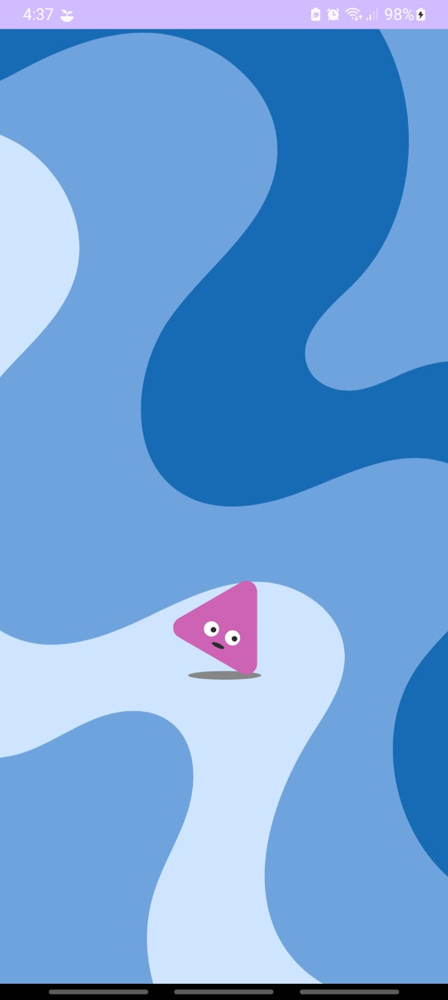
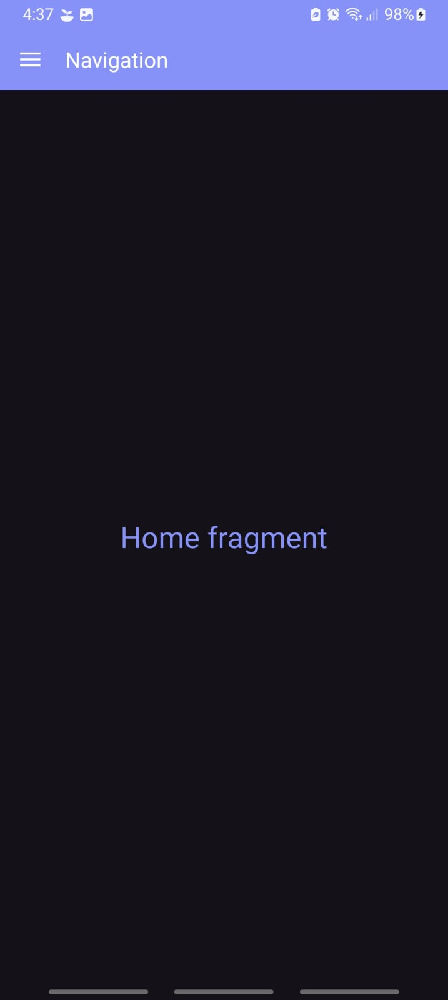
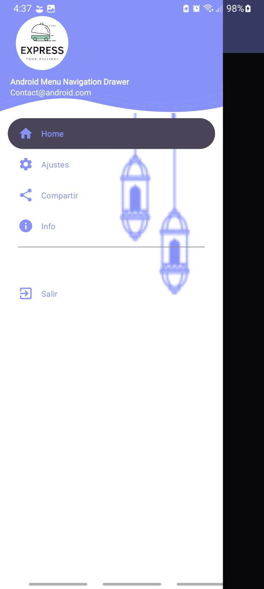

# splashscreen_toolbar
This is app create in Kotlin using splash screen and also toolbar is a nex view

## Installation

1. Clone the repository:
```bash
    https://github.com/AlvinRHD/splashscreen_toolbar.git
```
2. Open the project in Android Studio.
3. Build and run the app on an Android emulator or divace.


## Screenshots
| Loading Screen | Home Screen | Toolbar |
|:--------------:|:-----------:|:-------:|
|  |  |  |


